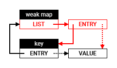

# Transpose
Revised: June 27, 2021

Warning: These notes are preliminary. Omissions and errors are likely. If you encounter problems, please ask for assistance.

## Weak Maps

In XS 10.8, weak maps and weak sets are fully transposed. 

Thanks [Mark S. Miller](https://en.wikipedia.org/wiki/Mark_S._Miller) for inspiration and review!

This document is only about weak maps but weak sets behave similarly. 

## Slot Diagram

Here is a diagram of the structures:

- Objects used as keys have one internal entry by weak map: the black `ENTRY` slot. 
- Weak map objects have one internal list: the red `LIST` slot. The list has one entry by key: the red `ENTRY` slot.
- The black `VALUE` slot contains the value and is shared by the weak map and the key. 

So, in a weak map, for each pair of key and value, there are three slots: one slot to contain the value, and two slots for corresponding entries, one in the list of the weak map and one in the key. 

`ENTRY` slots contain two references: the *check pointer* (solid line) and the *value pointer* (dotted line). In keys, the *check pointer* references the weak map.  In weak maps, the *check pointer* references the key. In both entries, the *value pointer* references the `VALUE` slot.
 
The `get` method, the `set` method (when updating a value), and the `delete` method use only the black part of the diagram.  The `set` method (when adding a key and a value)  and the garbage collector use the black and red parts of the diagram.

## Methods

- To get a value from a weak map, XS looks into the key for an entry that references the weak map. If the entry exists, XS returns the contents of its value.
- To set a value into a weak map, XS looks into the key for an entry that references the weak map. If the entry exists, XS updates the contents of its value, else XS adds a new entry to the key and a new entry at the front of the list of entries of the weak map.
- To delete a key from a weak map, XS looks into the key for an entry that references the weak map. If the entry exists, XS removes the entry from the key.

> The `delete` method relies on the garbage collector to eventually remove the corresponding entry from the list of entries of the weak map.

## Garbage collection

Please keep in mind that, in XS, all garbage collections are **complete** and reclaim all dead slots.

The garbage collector traverses and marks keys and weak maps like all objects:

- If a key is live, its entries are live. 
- If a weak map is live, its list is live and its entries are live. 

What is special is how the garbage collector traverses an entry: the garbage collector marks the slot referenced by the *value pointer* only if the slot referenced by the *check pointer* is live. So the value is live only if both the weak map and the key are live, independently of the order of traversal.

Eventually, when the garbage collector marked all live objects, the weak maps are cleaned up by iterating on their list of entries. For each entry of the list:

- If the entry is live but if its *value pointer* references a dead slot, XS removes the entry from the list.

> The slot that contains the value is dead if the key is dead or if the corresponding entry has been removed from the key by the `delete` method.

- If the entry is dead but if its *check pointer* references a live key, XS removes the entry that references the weap map from the key if it still exists.

> Since slots are reused, the cleanup is necessary to ensure that the following garbage collection does not mark a value without key.

## Examples

Here are a few examples that you can run in **xsnap**. 

For the sake of reporting, the examples use two non-standard features: the global `gc` function and the `FinalizationRegistry.prototype.cleanupSome` method. 

	const registry = new FinalizationRegistry(name => print("\t" + name));
	function gcRegister(object, name) {
	  registry.register(object, name);
	  return object;
	}
	function gcReport(step) {
	  print(step);
	  gc();
	  registry.cleanupSome();
	}

Since all garbage collections are complete, calling `gc(`) then `FinalizationRegistry.prototype.cleanupSome()` always cleans up all.

### Conformance

With `gcRegister` and `gcReport` functions in place, let us start with simple verifications...

#### If the key is dead, the value is dead:

	function test1() {
	  let map = gcRegister(new WeakMap, "map");
	  let key = gcRegister({ }, "key");
	  map.set(key, gcRegister({ }, "value"));
	  gcReport("1.1");
	  key = null;
	  gcReport("1.2");
	}
	test1();
	gcReport("1.3");

prints:

	1.1
	1.2
		key
		value
	1.3
		map

#### If the weak map is dead, the value is dead

	function test2() {
	  let map = gcRegister(new WeakMap, "map");
	  let key = gcRegister({ }, "key");
	  map.set(key, gcRegister({ }, "value"));
	  gcReport("2.1");
	  map = null;
	  gcReport("2.2");
	}
	test2();
	gcReport("2.3");

prints:

	2.1
	2.2
		map
		value
	2.3
		key

#### If the key is deleted, the value is dead

	function test3() {
	  let map = gcRegister(new WeakMap, "map");
	  let key = gcRegister({ }, "key");
	  map.set(key, gcRegister({ }, "value"));
	  gcReport("3.1");
	  map.delete(key);
	  gcReport("3.2");
	}
	test3();
	gcReport("3.3");

prints:

	3.1
	3.2
		value
	3.3
		map
		key

#### If the value is changed, the initial value is dead

	function test4() {
	  let map = gcRegister(new WeakMap, "map");
	  let key = gcRegister({ }, "key");
	  let value = gcRegister({ }, "value1");
	  map.set(key, value);
	  gcReport("4.1");
	  map.set(key, gcRegister({ }, "value2"));
	  gcReport("4.2");
	}
	test4();
	gcReport("4.3");
	
prints:
	
	4.1
	4.2
		value1
	4.3
		map
		key
		value2

### Consistency

Let us complicate the game a bit...
	
> Change the order of creation of weak maps and keys, or the order of call to the `set` method to change the order of traversal of the garbage collector.

#### Keys can be values and loop

	function test5() {
	  let map = gcRegister(new WeakMap, "map");
	  let key1 = gcRegister({ }, "key1");
	  let key2 = gcRegister({ }, "key2");
	  let key3 = gcRegister({ }, "key3");
	  map.set(key1, key3);
	  map.set(key2, key1);
	  map.set(key3, key2);
	  key1 = null;
	  key2 = null;
	  gcReport("5.1");
	  key3 = null;
	  gcReport("5.2");
	}
	test5();
	gcReport("5.3");

prints:

	5.1
	5.2
		key1
		key2
		key3
	5.3
		map

#### Weak maps can be values and loop

	function test6() {
	  let map1 = gcRegister(new WeakMap, "map1");
	  let map2 = gcRegister(new WeakMap, "map2");
	  let map3 = gcRegister(new WeakMap, "map3");
	  let key = gcRegister({ }, "key");
	  map1.set(key, map3);
	  map2.set(key, map1);
	  map3.set(key, map2);
	  map1 = null;
	  map2 = null;
	  gcReport("6.1");
	  map3 = null;
	  gcReport("6.2");
	}
	test6();
	gcReport("6.3");
	
prints:

	6.1
	6.2
		map1
		map2
		map3
	6.3
		key

